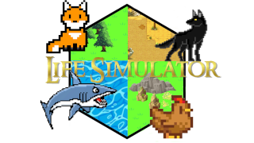

# Life™ Simulator   

*Carefully designed, created and maintained by Jakub Sukdol (sukdojak) 04/01/2022*

 

## Description

This java application simulates life of different entities. Those entities live on a hexagonal board with different kinds of biomes and try as hard as they can to survive. In order to do so they need to fulfill the basic requirements of each living creature. *They need to eat and reproduce.* Follow them on their majestic way of life! 

## Requirements

- OpenJDK 18.0.0.1 or higher

***For user manual and complete documentation see wiki page***   
